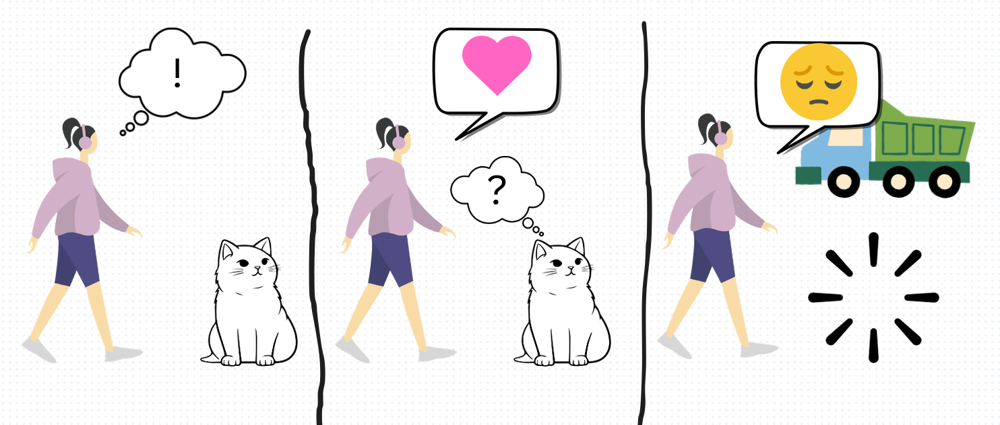
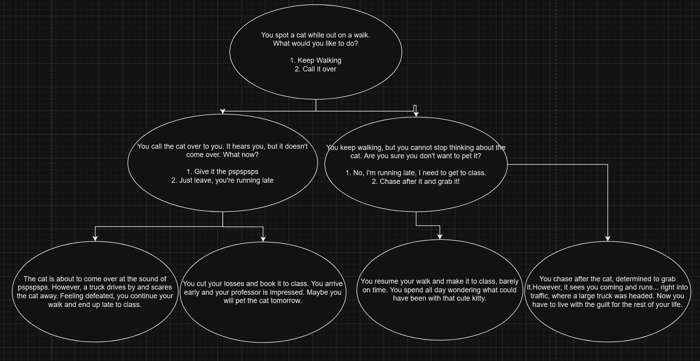

# Activity: Transmedia Adaptation

**IGME-110 | Week 5A | In-Class Activity | 10 points**

We're all familiar with adaptations. Books become movies, movies become games, games become TV
shows, and sometimes they go back to being books. Every time a story moves, something gets lost
and something gets added, because each medium is good at different things.

Today you'll watch that happen to your own story, fast. It works like a game of telephone. Your
team writes a very short story and hands it off. Three other teams turn it into a comic, then a
choose-your-own-adventure, then back into a story, and each of them only sees the version right
before theirs. At the end your story comes home. What survived the trip and what didn't is the
actual content of the class.

Everything you make today should be simple and rough. It's pencil and paper, stick figures are
fine, and nobody is grading your drawing.

**We do this in class. The write-up closes tonight.**

## Teams

You're working with your Project 1 team. Your team number is your P1 team number.

## The four rounds

Each round is 10 minutes, and each one goes on a fresh sheet of paper. I'll call time.

| Round | You're handed | You make |
|---|---|---|
| 1 | A story prompt | A story, about 100 words |
| 2 | Another team's story | A 3-panel comic with no words |
| 3 | Another team's comic | A choose-your-own-adventure flowchart |
| 4 | Another team's flowchart | A story, about 100 words |

### Round 1: Story

Your team gets a prompt slip. Keep it to yourselves.

Write a story of about 100 words, and no more. It won't be great literature, and that isn't the
goal. Try sticking to three beats: something happens, a character responds, and there's an
outcome.

### Round 2: Comic

Turn the story you were handed into a comic. Exactly three panels, and **no words**: pictures and
symbols only. Speech and thought bubbles are fine, as long as what's inside them is a picture or a
symbol and not text.

If the story is hard to show, take some artistic liberties. It's OK if the next team misreads your
comic. That's part of the fun.

### Round 3: Choose your own adventure

Turn the comic you were handed into a flowchart with three layers:

- One opening box that sets the scene and offers two choices
- Two middle boxes, one for each choice, and each of those offers two more choices
- Four ending boxes

That's 7 boxes and 4 endings. The boxes and arrows are already drawn on your sheet, so all you do
is fill them in: what happens in each box, and the choice on each arrow. It goes faster if you
decide the start together and then split up the rest.

### Round 4: Back to a story

Turn the flowchart you were handed into a story of about 100 words. A story only gets one path,
so your team will have to decide which way to go through the flowchart.

## An example

Professor Emily Horton made this for an online version of the activity, so she adapted her own
story and did it on a computer. Yours will be on paper, and every round after the first will be
someone else's work.

**The story:**

> On my walk this morning, I saw a stray cat. I stopped to call it over, and it seemed like it
> would. But then a loud truck drove by, scaring the cat away from me.

**The comic.** Three panels, no words. She says it took about five minutes.

**The flowchart.** One opening, two middle boxes, four endings.

Look at what already drifted between the two. The truck survived, but the flowchart invented a
class to be late for, a professor, and a much darker ending. Nobody decided to change the story.
The new format asked questions the old one never had to answer.

## How the handoff works

This is the part that can get chaotic, so there are only two rules.

1. **Things go into the envelope. Nothing comes out until it's home.** Your team starts with an
   envelope with your team number on it and your prompt clipped to the outside. Whatever is
   clipped on is the only thing you look at. When you finish a round, slide that sheet *into*
   the envelope and clip your new sheet on.
2. **Always pass to the next team number up.** The card on your table says who you get envelopes
   from and who you pass them to. The last team passes back to Team 1.

Your team also gets its own stack of printed sheets, one for each round. Use the one for the
round you're on, and circle your team number at the top.

So Team 3's story gets its comic from Team 4, its flowchart from Team 5, and its final story from
Team 6.

**After round 4, don't pass it on.** Walk the envelope back to the team number written on it.

## When your story comes home

Take everything out and lay it in order: the prompt, your story, the comic, the flowchart, and the
final story. As a team, talk through:

- How did the story change from version to version?
- What stayed the same all the way through?
- What was most different by the end, and at which step did it change?

## What to hand in

**One write-up per person, and that's the whole handin.** Write a paragraph or two on how your
story changed. You can summarize what your team said when the envelope came home, or give your
own take. Hand it in on myCourses before the end of the day. Everyone writes their own, even
though you worked as a team.

📸 **Photograph your five sheets before you leave.** I collect the envelopes at the end of class,
so the photos are what you'll be writing from tonight. They're for you, and you don't hand them
in.

**Optional: post them.** If you want to show your team's work off, reply in your section's thread
in **#110-inclass-activities** on Slack with your team number and your original prompt. It isn't
graded and it isn't required. It's just fun to see how far eight stories drifted.

## AI Expectations

The rounds are pencil and paper, so AI doesn't come into them.

**The write-up needs to be your own thinking**, so don't have a tool write it. Using one to check
spelling and grammar is fine. If you do, say which tool in a sentence at the end.
