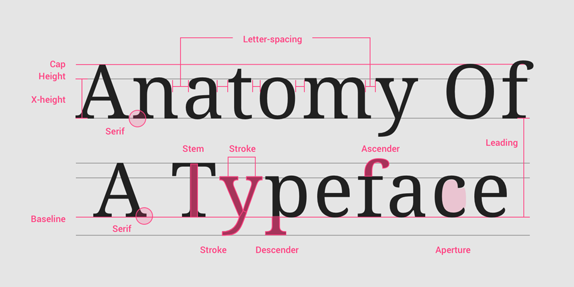
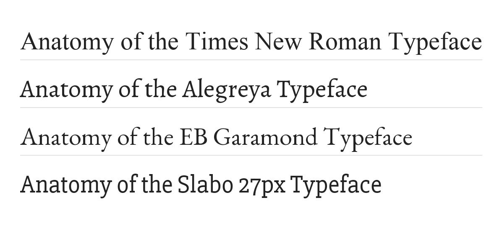
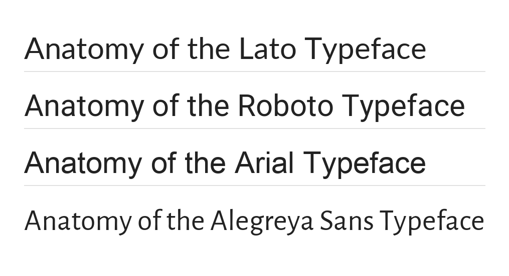
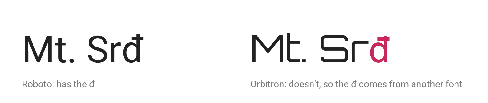
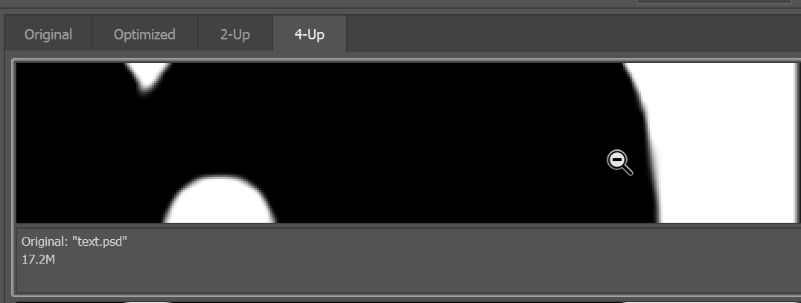

# Activity: Typography Core Concepts

**IGME-110 | Week 6B | In-Class Activity | 15 points**

Every letter on your screen is a small drawing. Somebody designed it, it lives in a file, and your
computer has to squeeze its curves onto a grid of square pixels. Study Guide 6 was about choosing
fonts and pairing them. This activity is about what a font actually is.

There are three parts. The first two happen in your browser. The third is in Photoshop, which is
on the machines in GOL 2000.

## Before you start

Make a copy of the **[answer worksheet](https://docs.google.com/document/d/1zc3-toKGL_knJ1cwA_4_4FETd8SnVF5jxNMFLvTYi8s/copy)**
and put your answers in it as you go.

A few steps ask a question without an action item. Those are just for you to think about, and you
don't need to write anything down for them.

## Part 1: Anatomy of a Typeface

A typeface (also called a font family) is made of one or more font files, and each file holds a
vector drawing of every character. Type designers work with the same parts of a letter that
printers have been naming for centuries:

### Serif typefaces

A serif is the small stroke at the end of a line in a letter. All four of these are serif
typefaces, set at the same size:

**Action item:** In your worksheet, list at least three specific things that vary across these
four. Use the terms from the diagram above: name the part, then say how it changes from one
typeface to the next.

### Sans serif typefaces

"Sans" is French for "without," so these have no serifs. They're all the same size again, and they
still look quite different:

**Action item:** Same thing. List at least three specific things that vary across these four,
using the terms from the diagram.

## Part 2: Digital Type Files

Open **[Roboto on Google Fonts](https://fonts.google.com/specimen/Roboto)**. It's one of the most
used typefaces on the web. Look for two things:

- **Who designed it.** Fonts have designers and licenses, just like images do. Everything on Google
  Fonts is free to use, but plenty of fonts elsewhere aren't.
- **How many styles it has.** Scroll down. There's every weight from Thin to Black, and an italic
  for each one.

For most of the history of digital type, each of those styles was its own file. Roboto now comes as
a **variable font**: one file that can draw any weight in between. Plenty of families still come as
separate files, one per style, so you'll run into both.

### Not every font has every letter

Fonts also differ in which characters they include. Mt. Srđ is the mountain above Dubrovnik, in
Croatia, and that last letter isn't used in English. Here it is in two fonts:

Roboto has a đ. Orbitron doesn't, so the browser borrows one from another font, and you can tell.
Other software might leave a blank space or draw an empty box instead. If your text will ever need
letters outside basic English (a name, a place, a game set somewhere else), check that the typeface
has them before you commit to it.

**Try it:** on Google Fonts, paste `Mt. Srđ` into the preview text box and scroll through some
fonts. (Copy the đ from this page.) Most fonts handle it. When one doesn't, the odd letter jumps
out at you. A font's own page also lists every character it includes, under **Glyphs**.

**Action item:** Using [Google Fonts](https://fonts.google.com/) or
[Adobe Fonts](https://fonts.adobe.com/), find a typeface you like that has **at least five styles**
and **supports Croatian** (it passes the Mt. Srđ test). Put a link to it in your worksheet, plus a
line on what you liked about it.

## Part 3: Anti-Aliasing

Letters are full of curves and angles, and screens are made of square pixels. Drawing a curve with
squares is like building a circle out of Lego: up close, the edges get jagged. **Anti-aliasing** is
how that gets hidden. It adds in-between shades along the edge, so from a normal distance the line
looks smooth. It applies to any line that isn't perfectly horizontal or vertical, not just type.

**Download [text.psd](https://github.com/jptweb/IGME-110-Fall-2026/raw/main/activities/_files/text.psd)**
and open it in Photoshop.

1. You should see the words "Example Text" in big bold letters. There are curves and angles, but
   they probably look smooth.
2. Zoom in (**View → Zoom In**) until you can see the gray pixels that soften the edge between the
   black letters and the white background.
3. Select the text layer in the Layers panel, and pick the Type tool. Now find the anti-aliasing
   setting. It's in three places, so use whichever you spot first:
   - In the menu bar: **Type → Anti-Alias**
   - Right-click the text and choose **Text Anti-aliasing**
   - In the options bar across the top of the window: a small menu right after the font size that
     starts out set to **Sharp**. Its icon is two small "a" letters.

   Cycle through the options (None, Sharp, Crisp, Strong, Smooth) and watch the edges change. You
   can skip the Mac or Windows ones at the bottom of the list. Then choose **View → Fit on Screen**
   and cycle through them again. At normal size the differences are much harder to see.
4. Set anti-aliasing to **Sharp**. Select the text and change its size from 128 pt to 512 pt, then
   zoom in on an edge again. It should look about the same as it did in step 2. That's because the
   text is still a vector, so Photoshop just redraws it at the new size.
5. Change the size back to 128 pt. Select the Background layer, then choose
   **Layer → Flatten Image**. This turns the vector text into pixels, and the Type tool can't edit
   it anymore.
6. Choose **Image → Image Size**. Make sure the units are pixels, not inches, and set the width to
   5000 px (the height follows along). Click OK, then zoom in on the curved edges again. How is it
   different from what you saw in step 2?
7. Choose **File → Export → Save for Web (Legacy)**. If you don't see four previews, click the
   **4-Up** tab at the top. Zoom and drag a preview so you can see the curve inside the letter m,
   like this:

   

8. Use the **Preset** menu to set up the previews:
   - Second preview: **JPEG High**
   - Third preview: **PNG-24**
   - Fourth preview: **GIF 128 Dithered**
9. Now change that GIF 128 preview to **JPEG Low**. What happens to the quality? (Wikipedia's page on
   [compression artifacts](https://en.wikipedia.org/wiki/Compression_artifact) explains what you're
   looking at.)

**Action item:** Take a screenshot of the window showing all four versions, and add it to your
worksheet. Then answer:

1. Which of the four versions from steps 8 and 9 has the smallest file size?
2. Which one would you put on a web page, and why?

## What to hand in

Download your finished worksheet as a Word file (**File → Download → Microsoft Word**) and hand it
in on myCourses by the end of the day. Check that it has:

- at least three serif differences and three sans serif differences
- a link to your typeface, and a line on why you picked it
- your Save for Web screenshot, and your answers to the two questions

## AI Expectations

This one is about training your own eye, so do Part 1 yourself: look at the letters and find the
differences. Asking a chatbot what a term from the diagram means is fine. Asking it to list the
differences for you skips the whole point.

If you use AI for anything, add a line to your worksheet saying which tool and what you used it
for.
